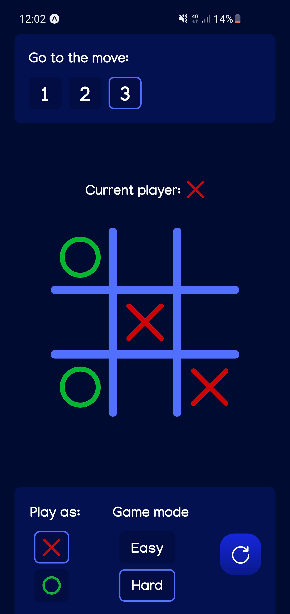

#### This is an interactive Tic-Tac-Toe mobile game (against bot) with 2 types of difficulty.
To run the app in Expo Go you can open this link: https://expo.dev/@antliann/tic-tac-toe

Easy mode - bot's moves are mostly random

Hard mode - you will never win :)

**P.S.** `Me from 2022:` I know that this project contains some ugly code, sorry, I was young and inexperienced :)
