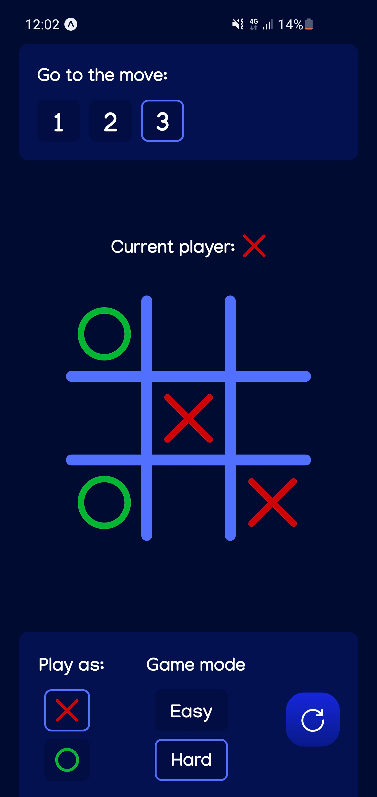

### This is an interactive Tic-Tac-Toe mobile game (against bot) with 2 types of difficulty.

# How to run the app:

### To run the app on android, install `builds/android/tic-tac-toe.apk` on your phone

### To run the app online on any mobile OS you can open this link: https://expo.dev/@antliann/tic-tac-toe
#### (you will need to install Expo Go on your phone)

### If you want to run/build the project on your PC:

#### Run this commands in the project directory:
1) Download all dependencies by running `npm install`
2) Do one of this:
    - run `expo start` in project folder
    - build project from `ios` folder in Xcode
    - build project from `android` folder in Android Studio

\
P.S. If Node.js is not installed on your PC, download it from
https://nodejs.org/en/download/
